# boot-es

## 安装elasticsearch

- 下载地址：[https://www.elastic.co/guide/en/elastic-stack/index.html](https://www.elastic.co/guide/en/elastic-stack/6.7/elastic-stack.html)

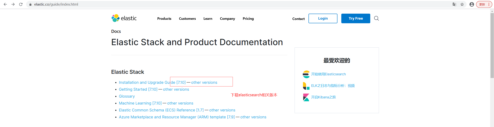

- 下载之后直接解压到相应目录

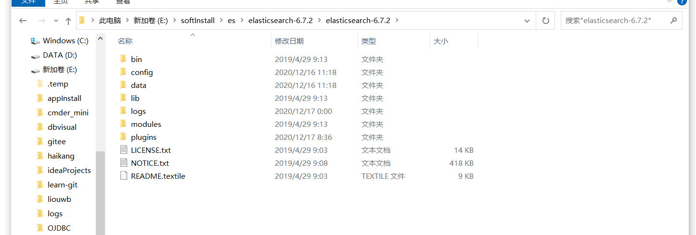

- 启动es bin目录下

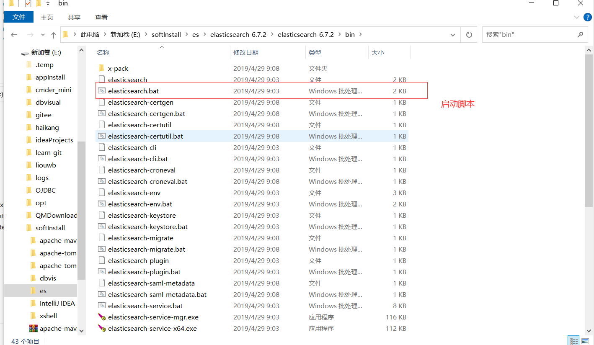

- 启动成功 访问地址 http://localhost:9200/

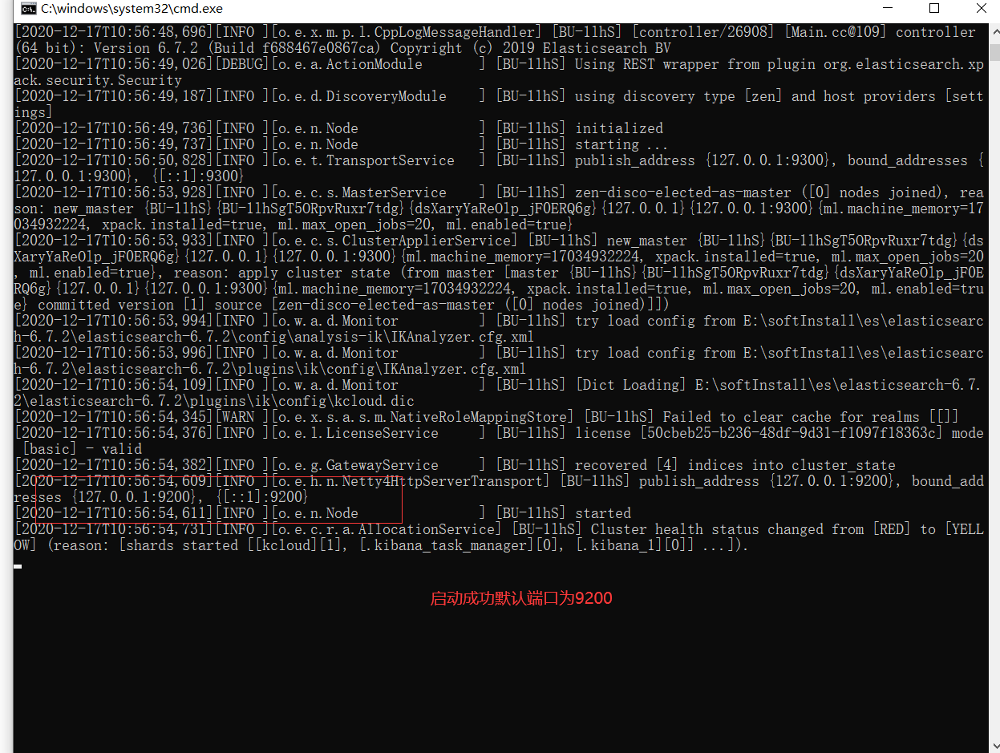

- 访问

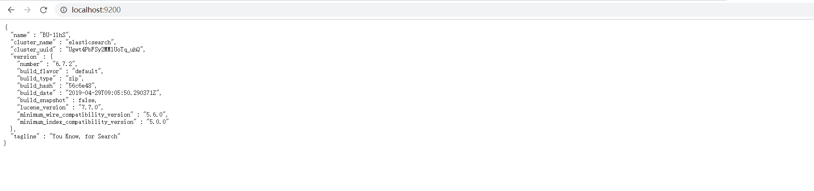

##  安装kibana

- 下载kibana版本与es版本一致
- 下载之后也解压到相关目录

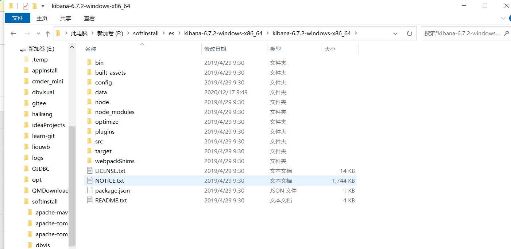

- 运行kibana 启动之后默认地址 http:localhost:5601

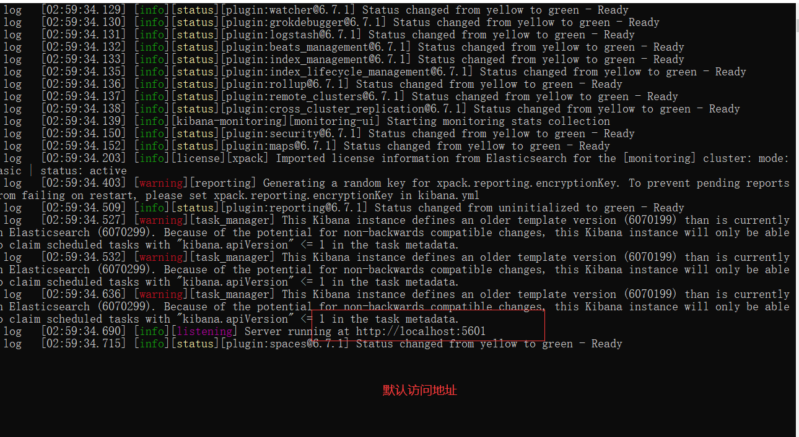

- 访问kinaba


- 访问之后默认是英文的 然后进行汉化 
- 修改config目录下的kibana.yml配置文件 最后一行添加 `i18n.locale: "zh-CN`

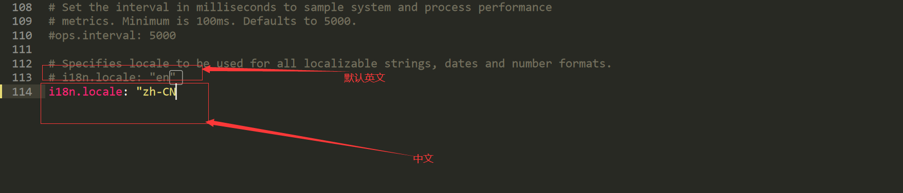

- 修改配置文件之后重启kinaba

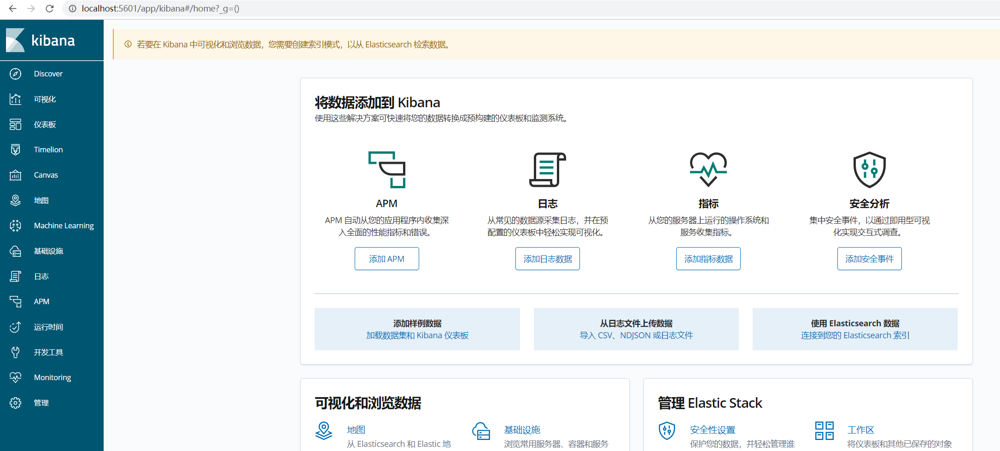


## 配置ik分词器插件

- 同样在elasticsearch官网下载和es版本一致的ik分词器插件

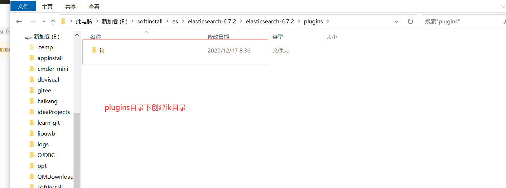

- 把下载的ik分词器插件解压后放到ik目录

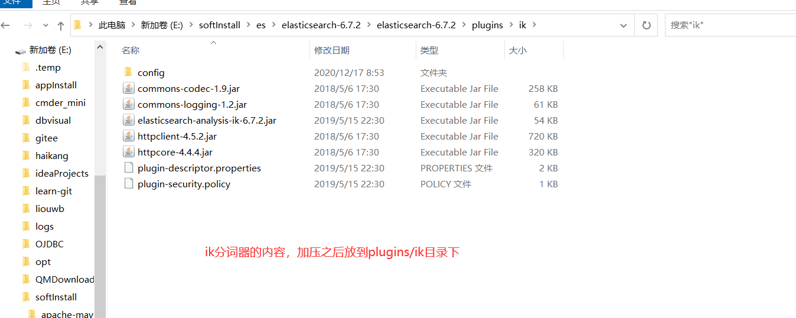

- 重启es

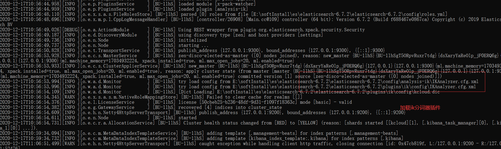

## kinaba使用

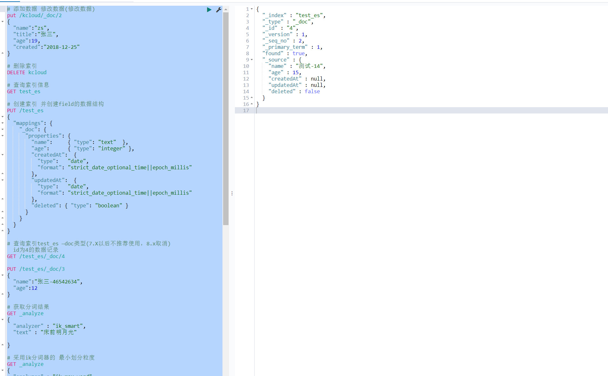

```json
# 添加数据 修改数据(修改数据)
put /kcloud/_doc/2
{
  "name":"zs",
  "title":"张三",
  "age":19,
  "created":"2018-12-25"
}

# 删除索引
DELETE kcloud

# 查询索引信息
GET test_es

# 创建索引 并创建field的数据结构
PUT /test_es
{
  "mappings": {
    "_doc": { 
      "properties": { 
        "name":     { "type": "text"  }, 
        "age":      { "type": "integer" },  
        "createdAt":  {
          "type":   "date", 
          "format": "strict_date_optional_time||epoch_millis"
        },
        "updatedAt":  {
          "type":   "date", 
          "format": "strict_date_optional_time||epoch_millis"
        },
        "deleted": { "type": "boolean" }
      }
    }
  }
}

# 查询索引test_es —doc类型(7.X以后不推荐使用，8.x取消)  id为4的数据记录
GET /test_es/_doc/4

PUT /test_es/_doc/3
{
  "name":"张三-46542634",
  "age":12
}

# 获取分词结果
GET _analyze
{
  "analyzer" : "ik_smart",  
  "text" : "床前明月光"
  
} 

# 采用ik分词器的 最小划分粒度
GET _analyze
{
  "analyzer" : "ik_max_word",  
  "text" : "床前明月光"
} 

# ik分词最大划分粒度
GET _analyze
{
  "analyzer" : "ik_max_word",
  "text" : "中国"
}
```


## springboot 2.3.2集成es 6.7.2

#### 一、添加依赖

```xml
        <dependency>
            <groupId>org.elasticsearch</groupId>
            <artifactId>elasticsearch</artifactId>
            <version>6.7.2</version>
        </dependency>
        <dependency>
            <groupId>org.elasticsearch.client</groupId>
            <artifactId>elasticsearch-rest-high-level-client</artifactId>
            <version>6.7.2</version>
        </dependency>
```

#### 二、配置

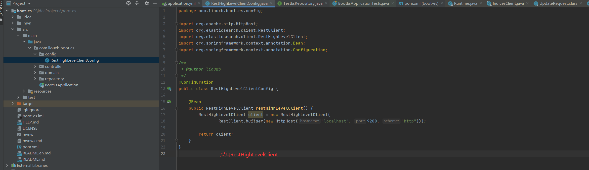

#### 三、java restapi操作es

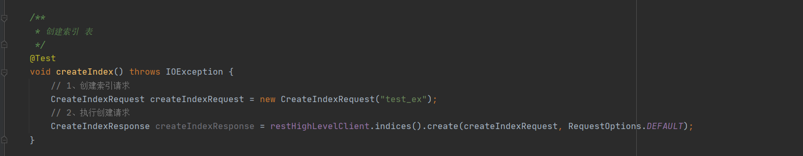